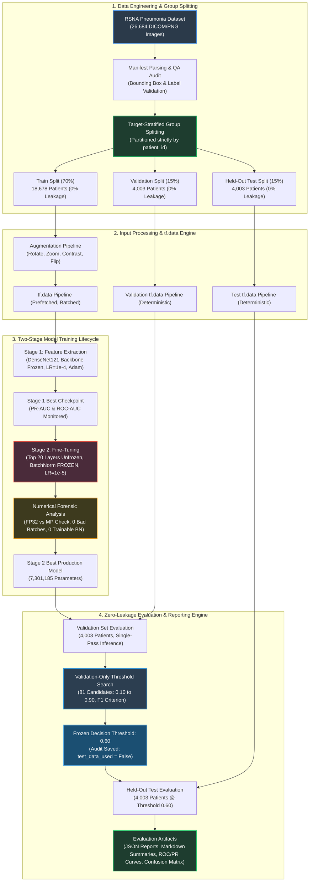

# 🏗️ MedVision-AI: System Architecture & End-to-End Pipeline

This document details the software architecture, data processing topology, staged model training lifecycle, and evaluation engine of MedVision-AI.

---

## 🗺️ End-to-End System Architecture

---

## 🧩 Architectural Modules Breakdown

### 1. Data Engineering & Group Splitting (`medvision.data`)
- **RSNA Manifest Parsing:** Ingests CSV metadata, cross-verifies bounding boxes ($x, y, w, h$), and maps multi-box records to patient-level binary classification targets (`0` = Normal/No Opacity, `1` = Pneumonia).
- **Patient-Aware Splitter:** Implements target-stratified group k-fold partitioning on `patient_id`. Audited automatically to enforce exactly **0% patient leakage** across train, validation, and test sets.
- **Development Loader:** Provides a 5% deterministic subset loader for lightweight local CPU unit testing and rapid CI verification without requiring the full 30 GB dataset.

### 2. High-Performance Input Pipeline (`medvision.data.pipeline`)
- **`tf.data.Dataset` Architecture:** Implements parallel decoding, image normalization, spatial resizing to $(224 \times 224 \times 3)$, and memory prefetching (`AUTOTUNE`).
- **Data Augmentation Engine:** Implements subtle medical-imaging-safe spatial transforms (random rotation $\pm 7^\circ$, random zoom $\pm 5\%$, horizontal flipping, contrast jitter $\pm 10\%$) applied exclusively during training.

### 3. Model Training & Fine-Tuning Lifecycle (`medvision.models`)
- **DenseNet121 Architecture:** Pre-trained on ImageNet with customized classification head: Global Average Pooling $\to$ Batch Normalization $\to$ Dropout ($p=0.4$) $\to$ Dense (128 units, ReLU, L2 regularized) $\to$ Dropout ($p=0.2$) $\to$ Dense (1 unit, Sigmoid).
- **Stage 1 (Feature Extraction):** Backbone frozen (`trainable = False`), classifier head trained with Adam ($LR = 10^{-4}$, gradient clipnorm = 1.0).
- **Stage 2 (Controlled Fine-Tuning):** Top 20 convolutional layers unfreezed. **Batch Normalization layers are explicitly locked (`trainable = False`)** to prevent non-i.i.d. running mean/variance corruption. Trained with low learning rate ($LR = 10^{-5}$).
- **Numerical Forensics:** Automated preflight verifies zero NaN/Inf gradients, zero exploding loss spikes, and exact FP32/mixed-precision equivalence.

### 4. Zero-Leakage Evaluation & Audit Engine (`medvision.evaluation`)
- **Strict Partition Isolation:** Threshold optimization receives only validation predictions (`val_y_true`, `val_y_pred_prob`).
- **Audit Persistence:** Generates `{model}_threshold_selection_audit.json` and `.md` recording the full 81-candidate scan history and verifying `test_data_used == False`.
- **Operating Point Evaluation:** The frozen threshold is applied to the 4,003-patient test split to generate multi-metric reports, confusion matrices, ROC curves, and Precision-Recall curves.
