# 🔬 MedVision-AI: Phase 8 — Grad-CAM Saliency & Visual Explainability Plan

> **Design specification and implementation roadmap for the Gradient-weighted Class Activation Mapping (Grad-CAM) visual explainability engine for the MedVision-AI DenseNet121 pneumonia detection model.**

---

## 📌 1. Objective & Clinical Explainability Rationale

While deep neural networks achieve high classification metrics on chest radiographs, clinical translation and engineering trust require **visual interpretability**. Clinicians and ML engineers must verify that the model grounds its predictions in pathological anatomical regions (e.g., focal parenchymal opacities, consolidation, air bronchograms) rather than extraneous artifacts (e.g., patient positioning markers, radiopaque monitoring leads, hospital tags).

**Phase 8** implements a modular, high-performance Grad-CAM engine in `src/medvision/explainability/gradcam.py` for post-hoc saliency visualization of the fine-tuned DenseNet121 model.

---

## 🏗️ 2. Model Architecture & Target Convolutional Layer

### DenseNet121 Topology & Layer Identification
The MedVision-AI classification backbone is **DenseNet121** (ImageNet pre-trained + custom classification head).

```mermaid
flowchart LR
    Input["Input CXR (224, 224, 3)"] --> BaseDenseNet["DenseNet121 Backbone"]
    subgraph BackboneDetails ["DenseNet121 Blocks"]
        DenseBlock1["Dense Block 1"] --> Trans1["Transition 1"]
        Trans1 --> DenseBlock2["Dense Block 2"]
        DenseBlock2 --> Trans2["Transition 2"]
        Trans2 --> DenseBlock3["Dense Block 3"]
        DenseBlock3 --> Trans3["Transition 3"]
        Trans3 --> DenseBlock4["Dense Block 4<br/>(16 Dense Layers)"]
        DenseBlock4 --> FinalConv["conv5_block16_2_conv<br/>(7×7, 32 filters)"]
        FinalConv --> Concat["conv5_block16_concat<br/>(7×7, 1024 channels)"]
        Concat --> FinalBN["bn (7×7, 1024)"]
        FinalBN --> FinalReLU["relu (7×7, 1024)"]
    end
    FinalReLU --> GAP["GlobalAveragePooling2D"]
    GAP --> HeadDense["Head: Dense(128) + BN + Dropout"]
    HeadDense --> Output["predictions: Dense(1, Sigmoid)"]
```



### Primary Target Layer: `conv5_block16_2_conv` / `relu`
- **Recommended Feature Map Layer:** `conv5_block16_2_conv` (or `relu` / `conv5_block16_concat` in DenseNet121)
- **Spatial Resolution:** $7 \times 7$ grid with $1,024$ feature channels.
- **Auto-Detection Fallback:** `auto_detect_target_conv_layer(model)` dynamically traverses `reversed(model.layers)` to find the final 4D tensor `(batch, 7, 7, C)` if explicit layer name is not supplied.

---

## ⚙️ 3. Expected Input Preprocessing & Inference Flow

1. **Input Ingestion:**
   - Supported inputs: 16-bit / 8-bit DICOM (`.dcm`), 8-bit grayscale / RGB PNG/JPEG.
2. **DICOM / Image Decoding:**
   - Rescaling slope/intercept applied for DICOM; converted to float array in $[0, 255]$.
   - Resized to $(224, 224, 3)$ using bilinear interpolation with antialiasing.
3. **Normalization:**
   - Scaled to $[0.0, 1.0]$ matching training configuration (`rescale_factor = 1.0 / 255.0`).
4. **Batch Dimension:**
   - Expanded to tensor of shape `(1, 224, 224, 3)` with `dtype=tf.float32`.

---

## 🧮 4. Grad-CAM Mathematical Algorithm & Pipeline

Given an input image $X$, target convolutional layer feature activations $A^k \in \mathbb{R}^{u \times v}$ (where $k \in \{1, \dots, K\}$ indexes channels), and class score $y^c$ (pre-sigmoid logit or post-sigmoid output):

### Step 1: Gradient Computation
Compute the gradient of the score $y^c$ with respect to feature map activations $A^k$:
$$\frac{\partial y^c}{\partial A_{i, j}^k}$$

### Step 2: Global-Average-Pooled Channel Importance Weights ($\alpha_k^c$)
$$\alpha_k^c = \frac{1}{Z} \sum_{i=1}^u \sum_{j=1}^v \frac{\partial y^c}{\partial A_{i, j}^k}$$
where $Z = u \times v = 49$ for $7 \times 7$ feature maps.

### Step 3: Weighted Linear Combination & Rectified Linear Unit (ReLU)
$$L_{\text{Grad-CAM}}^c = \text{ReLU}\left( \sum_{k=1}^K \alpha_k^c A^k \right)$$
*The ReLU operation ensures the heatmap isolates features that contribute positively to class $c$ (pneumonia).*

### Step 4: Bilinear Upsampling & Normalization
- Heatmap $L^c$ is normalized to $[0.0, 1.0]$:
  $$H_{\text{norm}} = \frac{L^c - \min(L^c)}{\max(L^c) - \min(L^c) + 10^{-8}}$$
- Bilinearly upsampled from $7 \times 7$ to input resolution $(224 \times 224)$ or native radiograph resolution $(1024 \times 1024)$.

---

## 🎨 5. Overlay Generation & Visual Styling

### Colormap Mapping
- Transform 2D float heatmap $H_{\text{norm}} \in [0, 1]$ to uint8 in $[0, 255]$.
- Apply OpenCV colormap `cv2.COLORMAP_JET` (or `COLORMAP_INFERNO` for medical contrast).
- Convert BGR to RGB.

### Blended Superimposition
$$\text{Overlay} = (1 - \alpha) \cdot \text{Image}_{\text{RGB}} + \alpha \cdot \text{Colormap}_{\text{RGB}}$$
- Default alpha blending parameter: $\alpha = 0.40$.

---

## 🧪 6. Sample Selection Strategy & Portfolio Visualizations

To construct a scientifically honest and recruiter-grade portfolio presentation, Phase 8 will generate a 4-quadrant comparative diagnostic panel:

| Cohort Category | Description | Ground Truth | Prediction ($t=0.60$) | Diagnostic / Engineering Value |
| :--- | :--- | :---: | :---: | :--- |
| **True Positive (TP)** | Clear consolidation / opacity | `1` (Pneumonia) | $\hat{y} \ge 0.60$ | Demonstrates precise localization over lung parenchyma |
| **True Negative (TN)** | Clear lung fields | `0` (Normal) | $\hat{y} < 0.60$ | Confirms low background activation and absence of false triggers |
| **False Positive (FP)** | Cardiomegaly / atelectasis | `0` (Normal) | $\hat{y} \ge 0.60$ | Identifies non-pneumonic opacities triggering model response |
| **False Negative (FN)** | Subtle / faint ground glass | `1` (Pneumonia) | $\hat{y} < 0.60$ | Exposes model sensitivity boundary and subtle pathology limits |

---

## 📁 7. File & Module Structure

```
src/medvision/explainability/
├── __init__.py
└── gradcam.py                   # Grad-CAM engine, gradient tape, overlay tools

scripts/
└── generate_gradcam_gallery.py # CLI batch generation script for portfolio assets

artifacts/explainability/        # Generated visual assets
├── gradcam_tp_sample_01.png
├── gradcam_tn_sample_01.png
├── gradcam_fp_sample_01.png
├── gradcam_fn_sample_01.png
├── gradcam_quad_comparison_grid.png
└── gradcam_summary_report.json
```

---

## 🖥️ 8. Streamlit UI Integration Contract

Phase 10 (Streamlit) will consume the Phase 8 module via a clean functional interface:

```python
from medvision.explainability.gradcam import compute_gradcam_heatmap, overlay_heatmap

# 1. Model inference
pred_prob = float(model.predict(preprocessed_tensor, verbose=0)[0][0])
is_pneumonia = pred_prob >= 0.60

# 2. Saliency computation
heatmap = compute_gradcam_heatmap(
    model=model,
    image_tensor=preprocessed_tensor,
    target_layer_name="conv5_block16_2_conv",
)

# 3. Blending
overlay = overlay_heatmap(
    heatmap=heatmap,
    original_image=display_image,
    alpha=0.40,
)

# 4. Streamlit side-by-side rendering
col1, col2 = st.columns(2)
with col1:
    st.image(display_image, caption="Original Radiograph", use_container_width=True)
with col2:
    st.image(overlay, caption=f"Grad-CAM Heatmap (Prob: {pred_prob:.1%})", use_container_width=True)
```

---

## 🚀 9. Future Execution Command

When Phase 8 is formally launched, portfolio assets will be generated via:

```bash
python scripts/generate_gradcam_gallery.py \
  --checkpoint final_artifacts/densenet121_stage2_best.keras \
  --manifest data/processed/splits/test_split.csv \
  --data-dir data/raw/stage_2_train_images \
  --output-dir artifacts/explainability \
  --threshold 0.60 \
  --num-samples-per-class 4
```
