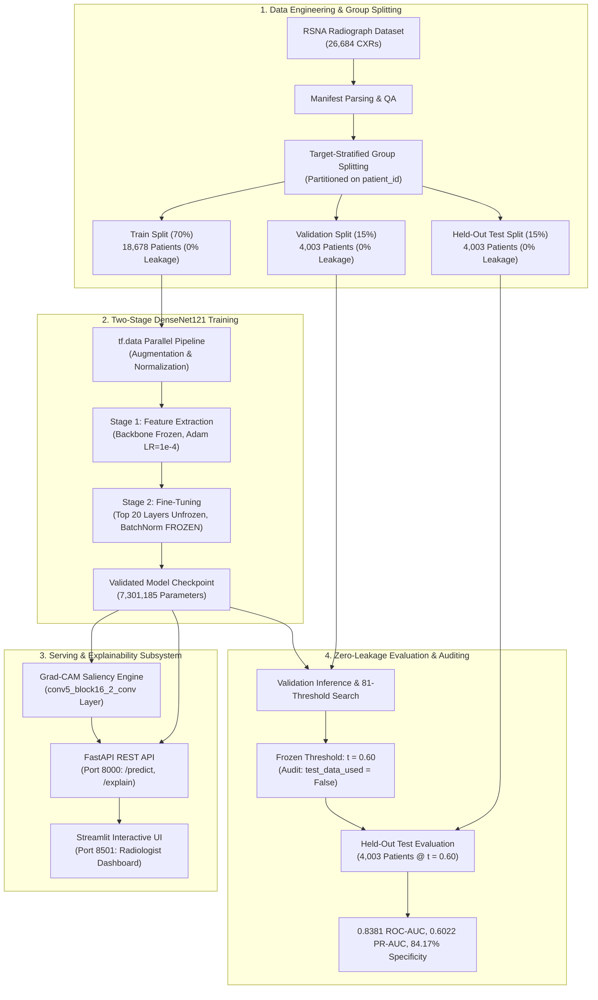

# 🏗️ MedVision-AI: Production Architecture Deep-Dive

> **End-to-end data pipeline, neural network topologies, explainability engine, and deployment subsystems.**

---

## 🗺️ System Topology

```mermaid
flowchart TD
    subgraph Ingestion ["1. Data Engineering & Group Splitting"]
        RSNA["RSNA Radiograph Dataset<br/>(26,684 CXRs)"] --> Manifest["Manifest Parsing & QA"]
        Manifest --> GroupSplit["Target-Stratified Group Splitting<br/>(Partitioned on patient_id)"]
        GroupSplit --> TrainSplit["Train Split (70%)<br/>18,678 Patients (0% Leakage)"]
        GroupSplit --> ValSplit["Validation Split (15%)<br/>4,003 Patients (0% Leakage)"]
        GroupSplit --> TestSplit["Held-Out Test Split (15%)<br/>4,003 Patients (0% Leakage)"]
    end

    subgraph Training ["2. Two-Stage DenseNet121 Training"]
        TrainSplit --> TFData["tf.data Parallel Pipeline<br/>(Augmentation & Normalization)"]
        TFData --> Stage1["Stage 1: Feature Extraction<br/>(Backbone Frozen, Adam LR=1e-4)"]
        Stage1 --> Stage2["Stage 2: Fine-Tuning<br/>(Top 20 Layers Unfrozen, BatchNorm FROZEN)"]
        Stage2 --> Ckpt["Validated Model Checkpoint<br/>(7,301,185 Parameters)"]
    end

    subgraph InferenceSubsystem ["3. Serving & Explainability Subsystem"]
        Ckpt --> GradCAM["Grad-CAM Saliency Engine<br/>(conv5_block16_2_conv Layer)"]
        Ckpt --> FastAPIService["FastAPI REST API<br/>(Port 8000: /predict, /explain)"]
        GradCAM --> FastAPIService
        FastAPIService --> StreamlitApp["Streamlit Interactive UI<br/>(Port 8501: Radiologist Dashboard)"]
    end

    subgraph EvaluationSubsystem ["4. Zero-Leakage Evaluation & Auditing"]
        Ckpt --> ValEval["Validation Inference & 81-Threshold Search"]
        ValSplit --> ValEval
        ValEval --> FrozenT["Frozen Threshold: t = 0.60<br/>(Audit: test_data_used = False)"]
        FrozenT --> TestEval["Held-Out Test Evaluation<br/>(4,003 Patients @ t = 0.60)"]
        TestSplit --> TestEval
        TestEval --> FinalMetrics["0.8381 ROC-AUC, 0.6022 PR-AUC, 84.17% Specificity"]
    end
```
