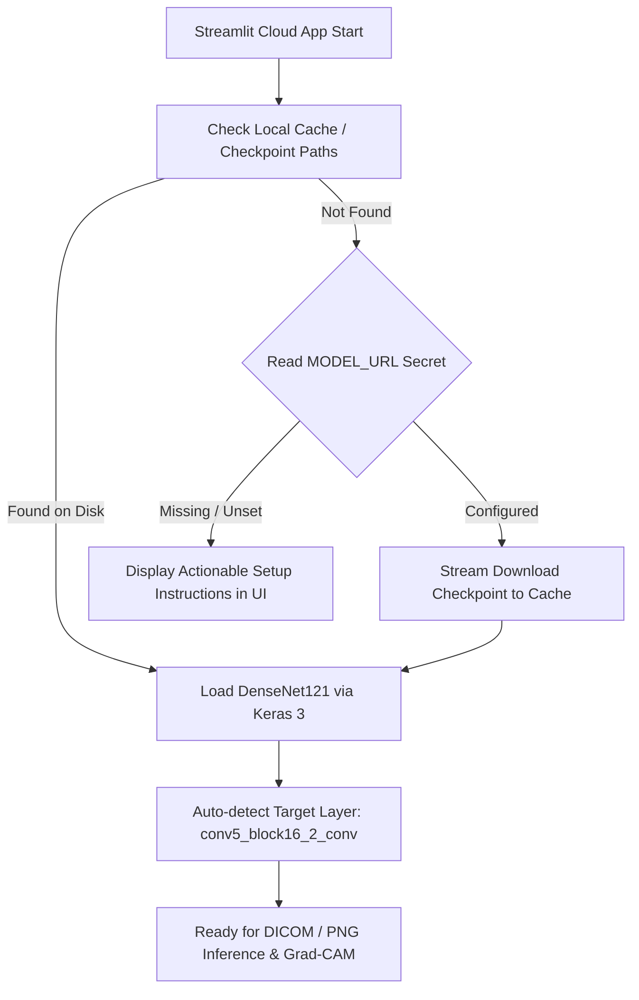

# ☁️ Streamlit Community Cloud Deployment Guide

> **Official operational deployment manual for deploying the MedVision-AI interactive radiograph dashboard to Streamlit Community Cloud.**

---

## 📋 Deployment Summary Specification

| Property | Value / Specification |
| :--- | :--- |
| **Target Platform** | Streamlit Community Cloud |
| **GitHub Repository** | `https://github.com/SwastikPandey1024/MedVision-AI` |
| **Target Branch** | `main` |
| **App Entrypoint** | `app/streamlit_app.py` |
| **Recommended Python Version** | `Python 3.11` |
| **Package Dependency File** | `requirements.txt` |
| **Model Weights File** | `densenet121_stage2_best.keras` (~28 MB - 65 MB) |
| **Required Secret / Env Variable** | `MODEL_URL` or `MEDVISION_MODEL_URL` |
| **Live Public Application URL** | [`https://medvision-ai-pneumonia.streamlit.app/`](https://medvision-ai-pneumonia.streamlit.app/) |

---

## 🎯 Architectural Overview

Streamlit Community Cloud clones the public GitHub repository into an ephemeral container environment. Because large deep learning model weights (`*.keras`) are excluded from version control for repository hygiene, MedVision-AI provides a **two-tier model acquisition strategy**:

1. **Local Disk Cache Check:** Inspects `final_artifacts/`, `models/checkpoints/`, `artifacts/models/`, and `~/.cache/medvision/`.
2. **Automated Remote Acquisition:** If local checkpoints are absent, the service reads the `MODEL_URL` or `MEDVISION_MODEL_URL` secret/environment variable, streams the verified Stage 2 `.keras` artifact into local cache (`models/checkpoints/`), and caches the instantiated model in memory using `@st.cache_resource`.



---

## 🚀 Step-by-Step Deployment Instructions

### Step 1: Host Model Weights (If not using local cache)
Upload the validated `densenet121_stage2_best.keras` file to a reliable public HTTPS storage location:
* **Option A (Recommended):** GitHub Release asset on your repository (e.g., `https://github.com/SwastikPandey1024/MedVision-AI/releases/download/v0.1.0-alpha/densenet121_stage2_best.keras`).
* **Option B:** Hugging Face Model Hub direct download URL.
* **Option C:** AWS S3 / Google Cloud Storage public signed URL.

### Step 2: Access Streamlit Community Cloud
1. Navigate to [share.streamlit.io](https://share.streamlit.io) and log in with your GitHub account.
2. Click **"New app"** (or **"Create app"**).

### Step 3: Configure Repository Settings
Fill out the deployment form:
* **Repository:** `SwastikPandey1024/MedVision-AI`
* **Branch:** `main`
* **Main file path:** `app/streamlit_app.py`
* **App URL:** `medvision-ai` (or your chosen subdomain)

### Step 4: Configure Advanced Settings & Secrets
1. Click **"Advanced settings..."** before deploying.
2. Select **Python version:** `3.11`.
3. In the **Secrets** TOML editor, add the model URL:
   ```toml
   MODEL_URL = "https://github.com/SwastikPandey1024/MedVision-AI/releases/download/v0.1.0-alpha/densenet121_stage2_best.keras"
   ```
4. Click **Save**.

### Step 5: Deploy App
Click **"Deploy!"**. Streamlit Cloud will:
1. Provision a Python 3.11 container.
2. Run `pip install -r requirements.txt`.
3. Launch `app/streamlit_app.py`.
4. Download and cache the model checkpoint on first startup.

---

## ⚙️ Environment Variables & Secrets Reference

| Variable / Secret Key | Required | Default | Description |
| :--- | :---: | :--- | :--- |
| `MODEL_URL` | Yes (on Cloud) | `None` | Direct URL to download `densenet121_stage2_best.keras`. |
| `MEDVISION_MODEL_URL` | Alternative | `None` | Alias for `MODEL_URL`. |
| `MEDVISION_MODEL_PATH` | Optional | `None` | Local filepath override to custom model checkpoint. |

---

## 🛠️ Troubleshooting & FAQ

### 1. Error: `DenseNet121 Stage 2 checkpoint not found`
* **Cause:** The app started without a local `.keras` file and without a `MODEL_URL` secret.
* **Solution:** Go to **App Settings $\rightarrow$ Secrets** in the Streamlit Cloud dashboard, configure `MODEL_URL = "https://..."`, and reboot the app.

### 2. DICOM Upload Fails with `ModuleNotFoundError: No module named 'pydicom'`
* **Cause:** `pydicom` was missing from `requirements.txt`.
* **Solution:** Ensure `pydicom>=2.4.0` is present in `requirements.txt` (verified in `main`).

### 3. App Runs Out of Memory (OOM) During Model Loading
* **Cause:** DenseNet121 occupies ~28 MB in memory, which easily fits within Streamlit Community Cloud's 1 GB RAM limit. If memory spikes occur during multiple user sessions, `@st.cache_resource` ensures only a single instance of the model weights is loaded across all sessions.

### 4. Grad-CAM Layer Not Found
* **Cause:** Custom layer names altered during deserialization.
* **Solution:** `auto_detect_target_conv_layer()` automatically resolves the deepest 4D convolutional feature layer (`conv5_block16_2_conv`).

---

## ⚖️ Non-Clinical Compliance Notice
MedVision-AI is an academic deep learning engineering prototype. It is **not** an FDA/CE-cleared medical device and must **never** be used for clinical diagnosis, patient screening, or clinical decision-making.
